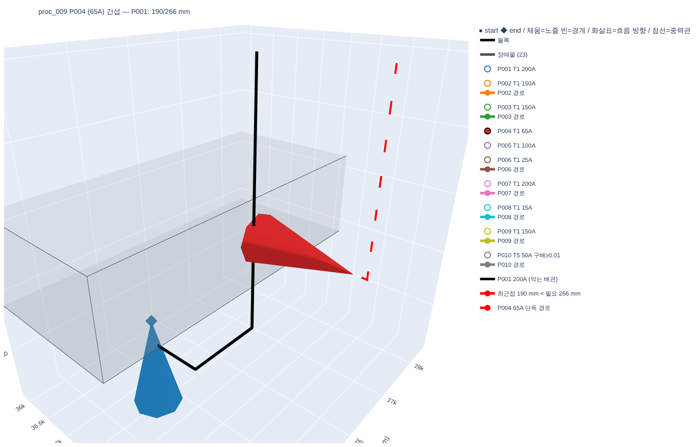
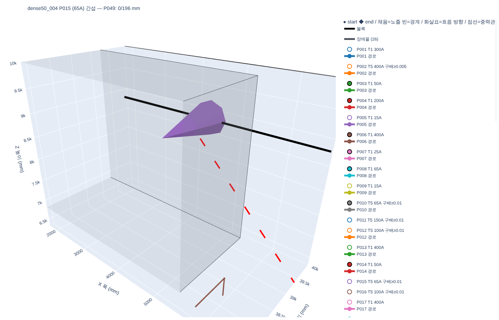
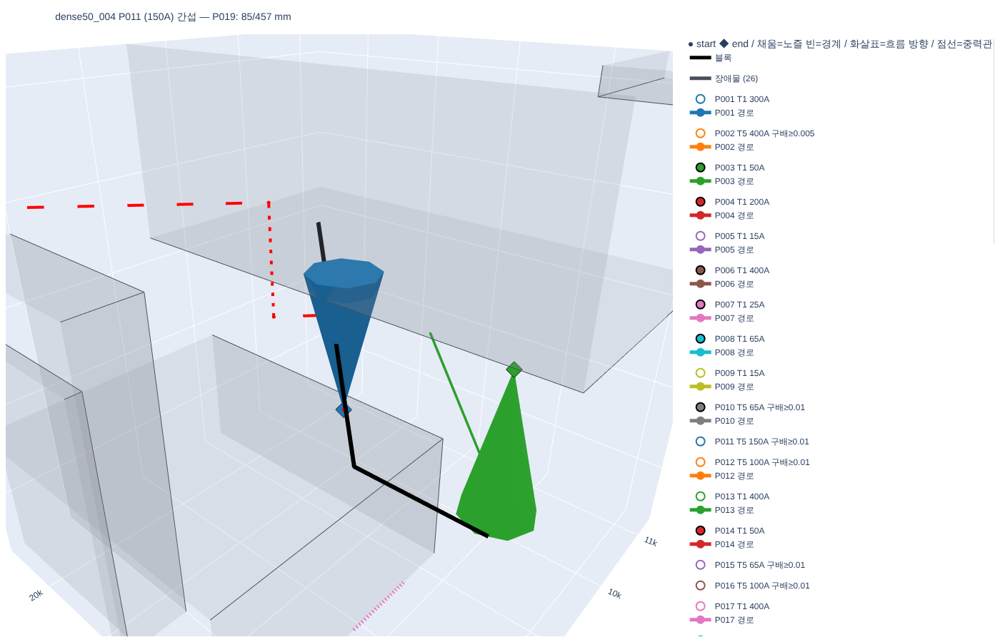
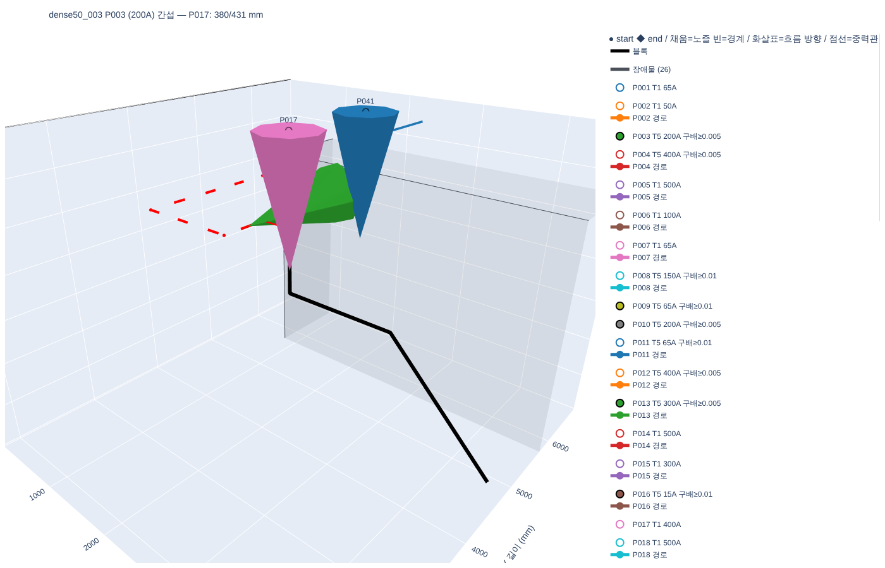

# 8단계 보고 — 시나리오 세트 실행 + 밀집 시험 (D58)

모든 실행: 순차 배치 (D50·D52), 배관당 60초 (D40), 4병렬, 라우터 = 2층 구조 + 추정 서포트 (D55·D57).
기본 세트 = procedural 20 + 수작업 1. 밀집 세트 = 같은 생성기 설정(D30)에서 배관 수만 30·50, 각 5개 (seed 20262008~, 20263008~, 요청한 배관 수 모두 생성됨).
오류로 끝난 실행 0건 (기본 21 × A·B, 밀집 10 × A·B).

## 첨부 3D 리포트 (CLAUDE.md §0 보고 규칙)

배관 = 실제 굵기 관 (외경 + 보온재), 범례의 "유효 반경 관 (D17)" 을 켜면 이격 판정 반경이 보인다. 파일은 보고 메시지 첨부 (`out/` 은 커밋 안 함, D36).
다시 만들기: `python -m pipe_routing.pipeline <scenario> -o <출력 폴더> --html-only` (기존 출력 JSON 으로 HTML 만, plotly.js 포함).

| 파일 | 내용 |
|---|---|
| `manual_01_report.html` | 수작업 (A + D57), 통과 3/5 — T5 구배 위반 2 |
| `proc_009_report.html` | procedural 실패 사례 — P004 간섭-차단, P005 간섭-탐색(unreachable, M20) |
| `dense50_004_report.html` | 밀집 50배관 — 간섭-차단 5건 (P015 단자 점유 포함) |
| `case_proc_009_P004(_close).html` · `case_dense50_004_P015(_close).html` · `case_dense50_003_P003(_close).html` | 간섭 사례 근접 화면 (막는 배관 검정, 실패 배관 단독 경로 빨강) |

## 1. 기본 세트 — A (M4 반영) vs 7.5단계 현재 방식

| 지표 | 7.5단계 현재 방식 (D53) | 8단계 A + D57 |
|---|---|---|
| 경로 있는 배관 | 200/200 | 198/200 |
| timeout · unreachable | 0 · 0 | 0 · 2 |
| Layer 0 통과 (T1 / T5) | 146 (145/145 · 1/55) | 143 (143/145 · 0/55) |
| 배관 간 충돌 | 0 | 0 |
| rip-up (되돌림) | 1 (0) | 2 (1) |
| 실패 3분류 | 0 · 0 · 0 | 간섭-차단 1 · 간섭-탐색 1 (unreachable, M20) · 개별 0 |
| 그래프 준비 중앙 / 최대 (s) | 2.3 / 12.0 | 3.6 / 14.4 |
| 탐색 중앙 / 최대 (s) | 1.66 / 52.7 | 0.94 / 23.6 |
| 시나리오 전체 중앙 / 최대 (s) | 94 / 157 | 69 / 132 |
| 공통 198배관 직관 / 엘보 | 287,164 / 30,754 | 292,519 (+1.9%) / 31,280 (+1.7%) |
| 공통 198배관 서포트 (검증기) | 18,676 | **11,461 (−38.6%)** |
| **공통 198배관 J 합** | 336,595 | **335,260 (−0.4%)** |
| 공통 198배관 실중량 | 297,358 | 294,965 (−0.8%) |
| 수작업 J 합 (5배관) | 3,673.6 | **3,250.3 (−11.5%)** |

7.5단계 현재 방식 수치는 지지선 막힘 정확 판정(D57 구현 시 검증기 수정) 이전 검증기로 계산했다.
A 전환만의 대가(J +1.3%, 7.5단계)를 서포트 근사(D57)가 갚고도 남는다.

## 2. 밀집 세트 — 배관 수별, A 와 B

| 지표 | A 10 | A 30 | A 50 | B 10 | B 30 | B 50 |
|---|---|---|---|---|---|---|
| 시나리오 · 배관 | 20 · 200 | 5 · 150 | 5 · 250 | 20 · 200 | 5 · 150 | 5 · 250 |
| 경로를 찾은 배관 | 99.0% | **100%** | **90.0%** | 99.5% | 99.3% | 91.6% |
| Layer 0 통과율 | 71.5% | 69.3% | 59.6% | 72.0% | 68.7% | 59.2% |
| T1 통과 | 143/145 | 104/104 | 149/163 | 144/145 | 103/104 | 148/163 |
| T5 통과 (구배 위반) | 0/55 (55) | 0/46 (46) | 0/87 (76) | 0/55 (55) | 0/46 (46) | 0/87 (81) |
| **간섭-차단** (배관 비율) | 1 (0.5%) | 0 (0%) | **25 (10.0%)** | 1 (0.5%) | 1 (0.7%) | **21 (8.4%)** |
| 간섭-탐색 · 개별 경로 | 1 · 0 | 0 · 0 | 0 · 0 | 0 · 0 | 0 · 0 | 0 · 0 |
| 차단 실패 중 timeout / unreachable | 0 / 1 | – | 10 / 15 | 0 / 1 | 0 / 1 | 13 / 8 |
| rip-up (되돌림) | 2 (1) | 6 (0) | 15 (9) | 1 (1) | 4 (1) | 14 (11) |
| timeout (전체) | 0 | 0 | 10 | 0 | 0 | 13 |
| 배관당 시간 중앙 / 최대 (s, 준비 + 탐색 합) | 5.2 / 25 | 8.7 / 80 | 19.9 / 159 | 6.5 / 30 | 13.6 / 127 | 42.3 / 231 |
| 탐색 중앙 / 최대 (s) | 0.94 / 24 | 2.0 / 41 | 5.2 / 60 | 1.05 / 22 | 2.5 / 41 | 6.8 / 60 |
| 시나리오 전체 중앙 / 최대 (s) | 69 / 132 | 465 / 642 | 1,545 / 2,634 | 84 / 144 | 800 / 876 | 2,845 / 4,356 |
| 메모리 최대 (MB, 프로세스) | 1,072 | 1,111 | 1,344 | 1,085 | 1,239 | 1,509 |
| B − A J (공통 배관) | | | | −0.1% (198) | −0.47% (149) | −0.37% (220) |

## 3. 간섭-차단 실패 진단 (A, 50배관 25건 + 기본 1건)

같은 최종 배치 위에서 각 실패 배관을 다시 라우팅해 원인을 나눴다. 배관마다 escape graph(7단계 방식)는
놓인 배관 ~49개에서 메모리 초과로 쓸 수 없었다 (M18 의 3차 증가가 실제로 드러남).

| 유형 | 건수 | B 로 같은 배치에서 해결 | B timeout | B unreachable |
|---|---|---|---|---|
| **단자 점유**: 놓인 배관이 실패 배관의 단자 직진 구간(§3.3 최소 직진) 안 r₁ + r₂ 로 지나감 | 13 | 1 | 6 | 6 |
| 통로 경합 | 13 | **6** (격자선 부족) | 6 (판정 불가) | 1 (공간 없음) |

B 실행에서도 간섭-차단 23건 중 12건이 단자 점유. → 절반은 표현(격자선) 문제가 아니라 배치 순서·단자 예약 문제다 (M21).

### 사례 (근접 화면, 검은 선 = 막는 배관, 빨간 점선 = 실패 배관 단독 경로, 빨간 실선 = 최근접 거리)

| 사례 | 유형 | 화면 |
|---|---|---|
| proc_009 P004 65A — P001 이 노즐 옆 190 mm (필요 266) | 단자 점유, 공간 없음 |  |
| dense50_004 P015 65A — P049 가 단자를 그대로 관통 (0 / 196 mm) | 단자 점유 |  |
| dense50_004 P011 150A — P019 85 / 457 mm, B 로 해결 | 격자선 부족 (단자 근처) |  |
| dense50_003 P003 200A — P017 380 / 431 mm, B 로 해결 | 격자선 부족 (나란히 배치) |  |

3D 원본: `python -m pipe_routing.caseview <scenario> <output.json> <pipe> -o out/case.html`

## 4. D8 (RL/GNARL 역할) 판단 근거

| 배관 수 | 간섭-차단 비율 (A / B) | 그중 단자 점유 | 개별 경로 실패 | 단일 경로 탐색 중앙 / 최대 (A) | 탐색 timeout (A) | T5 구배 실패 |
|---|---|---|---|---|---|---|
| 10 | 0.5% / 0.5% | 1/1 | 0 | 0.94 / 24 s | 0 | 55/55 (100%) |
| 30 | 0% / 0.7% | – | 0 | 2.0 / 41 s | 0 | 46/46 (100%) |
| 50 | **10.0% / 8.4%** | 13/25 | 0 | 5.2 / 60 s | 10 (모두 간섭-차단) | 76/87 (나머지 11 은 경로 없음) |

읽는 법: 배관이 혼자일 때 경로를 못 찾는 경우(개별 경로)는 모든 밀도에서 0 — 단일 경로 탐색은 기준선으로 충분하다.
실패는 배관 수가 많아질 때 **배관 간 간섭**으로 생기고(50개에서 10%), 그 절반은 순서·단자 예약으로 피할 수 있었던 단자 점유다.
→ RL/GNARL 의 역할은 단일 경로 휴리스틱보다 **다중 배관 순서·재배치**(다중 배관 슬롯) 쪽에 근거가 쌓인다.
중력관 구배(T5)는 라우터가 구배를 모르므로(D27) 여전히 100% 실패 — 별도 과제.
